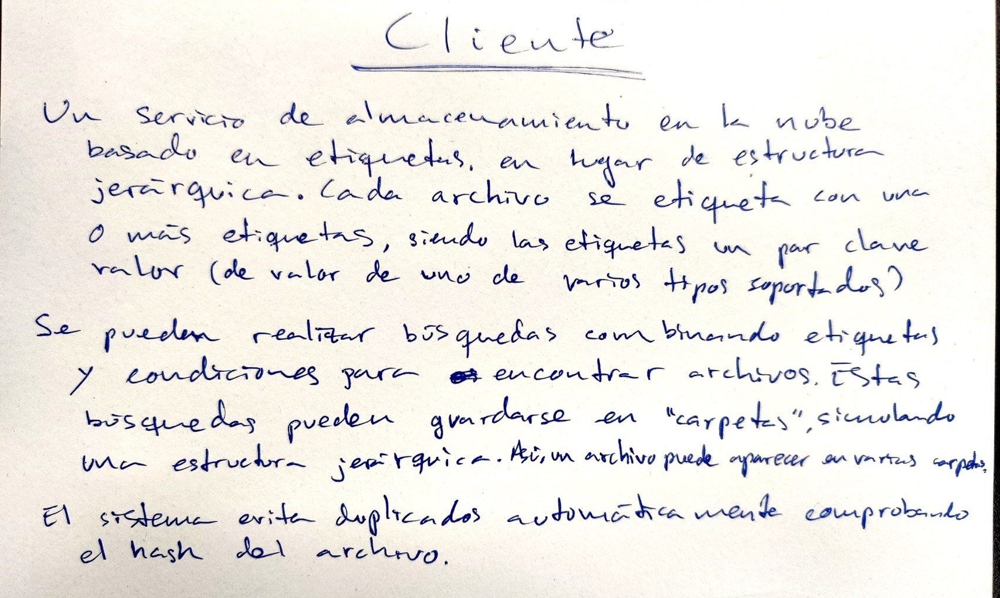

# TagDrive

## Problema a tratar

A lo largo de mi vida y, especialmente, en la universidad, he encontrado problemas a la hora de almacenar archivos en mi ordenador así como en la nube. Muchas veces he querido almacenar el mismo archivo en 2 ubicaciones diferentes, por ejemplo, al tratarse de apuntes de una asignatura que he cursado varios años o documentación que necesitaba presentar en diferentes ocasiones. Esto ha implicado duplicar muchos archivos de manera innecesaria o invertir considerables cantidades de tiempo en ubicarlos y ordenarlos de la mejor forma posible. Asimismo, la búsqueda estándar por nombre me fuerz a incrustar en el nombre de elos archivos identificadores, como las iniciales de una asignatura, para poder realizar una búsqueda eficiente.

## Lógica de negocio requerida

En adición a las operaciones CRUD de subida, descarga y eliminación de archivos y edición de etiquetas, la implementación requerirá lógica para:
- La realización de búsquedas con sentencias lógicas complejas, incluyendo variables dinámicas como la fecha y hora en el momento de la búsqueda.
- Analizar los archivos subidos calculando su hash e impedir la creación de archivos duplicados, realizando las fusiones de etiquetas pertinentes.
- Diferenciar entre nombres duplicados y archivos duplicados, gestionando adecuadamente la subida de nombres duplicados sin perder archivos.

## Datos requeridos

Los usuarios aportarán los archivos e indicarán a qué categorías deberían perteneces, así como posibles reeelaciones entre ellas. El sistema calculará autónomamente los datos necesearios para evitar colisiones así como computará categorías a partir de las relaciones establecidas y las indicaciones originales de los usuarios.

## Configuración

En el siguiente archivo se puede encontrar la configuración de Git y GitHub para realizar la subida de los archivos: [docs/configuracion.md](docs/configuracion.md).
